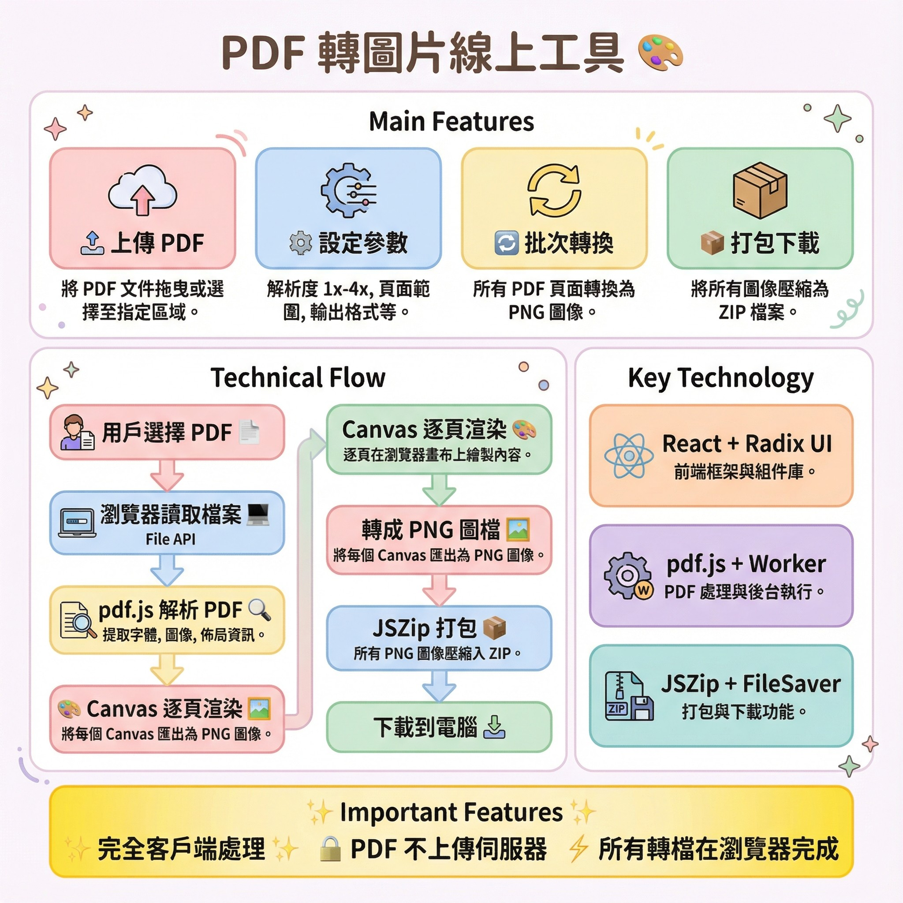

# NotebookLM 簡報後製工具箱

> 🌐 **線上預覽**：[https://pdf-tool.vivichen.ai/](https://pdf-tool.vivichen.ai/)



本專案提供兩大核心功能，所有處理皆在瀏覽器端完成，不上傳檔案，確保您的資料安全：

- **PDF 轉高畫質 PNG**：將整份 PDF 逐頁輸出成高品質圖檔，方便進一步編修。
- **PDF 頁面替換**：將修改後的單頁 PNG 匯回原 PDF，產出新的 PDF。

## ✨ 功能特色

- 🔒 **完全本地處理**：所有檔案處理都在瀏覽器端完成，不會上傳到任何伺服器
- 🎨 **高品質輸出**：PDF 轉換為高解析度 PNG 圖片，保留原始品質
- 🔄 **智慧頁面替換**：輕鬆將修改後的圖片替換回原始 PDF 的指定頁面
- 📱 **響應式設計**：支援各種裝置，包含桌面和行動裝置
- ⚡ **快速處理**：使用現代化技術，提供流暢的使用體驗

## 🚀 快速開始

### 環境需求

- Node.js 18+（建議搭配 npm 10+）

### 安裝依賴

```bash
npm install
```

### 本地開發

```bash
npm run dev -- --host --port 8080
```

啟動後可在終端顯示的網址（預設 http://localhost:8080 或自動轉到其他埠）預覽。

### 專案腳本

- `npm run dev`：啟動本地開發伺服器（Vite）
- `npm run build`：產出生產環境靜態檔案
- `npm run build:dev`：產出開發環境靜態檔案
- `npm run preview`：以本地伺服器預覽 build 結果
- `npm run lint`：執行 ESLint 檢查

## 📁 專案結構

```
pdftool-main/
├── src/
│   ├── components/          # React 組件
│   │   ├── ui/              # shadcn/ui 基礎組件
│   │   ├── PdfConverter.tsx # PDF 轉圖片組件
│   │   ├── PdfReplacer.tsx  # PDF 頁面替換組件
│   │   ├── UploadZone.tsx   # 檔案上傳區域
│   │   └── ...
│   ├── pages/               # 頁面組件
│   │   ├── Index.tsx        # 主頁面
│   │   └── NotFound.tsx     # 404 頁面
│   ├── hooks/               # 自訂 Hooks
│   ├── lib/                 # 工具函數
│   │   ├── utils.ts         # 通用工具
│   │   └── watermarkRemover.ts # 浮水印移除工具
│   ├── assets/              # 靜態資源
│   ├── App.tsx              # 應用程式入口
│   └── main.tsx             # 應用程式啟動點
├── public/                  # 公開資源
│   ├── favicon.ico          # 網站圖示
│   ├── favicon-16x16.png    # 16x16 圖示
│   ├── favicon-32x32.png    # 32x32 圖示
│   ├── icon-apple-180x180.png    # Apple Touch Icon
│   ├── icon-android-192x192.png  # Android 圖示
│   ├── icon-pwa-512x512.png      # PWA 圖示
│   ├── manifest.json        # PWA 設定檔
│   └── ...
├── package.json
├── vite.config.ts           # Vite 設定
├── tailwind.config.ts       # Tailwind CSS 設定
├── tsconfig.json            # TypeScript 設定
└── README.md
```

## 🛠️ 技術棧

- **前端框架**：React 18 + TypeScript
- **建置工具**：Vite
- **樣式系統**：Tailwind CSS
- **UI 元件庫**：shadcn/ui（基於 Radix UI）
- **PDF 處理**：
  - `pdfjs-dist` - PDF.js 用於 PDF 解析和渲染
  - `pdf-lib` - PDF 文件操作和頁面替換
- **其他工具**：
  - `@techstark/opencv-js` - 圖像處理（浮水印移除）
  - `file-saver` - 檔案下載
  - `jszip` - ZIP 檔案處理
  - `react-router-dom` - 路由管理
  - `@tanstack/react-query` - 資料狀態管理

## 📖 使用說明

### PDF 轉圖片

1. 點選「PDF 轉圖片」標籤
2. 上傳您的 PDF 檔案
3. 等待處理完成
4. 下載轉換後的 PNG 圖片（單張或 ZIP 壓縮檔）

### PDF 頁面替換

1. 點選「PDF 頁面替換」標籤
2. 上傳原始 PDF 檔案
3. 上傳要替換的 PNG 圖片
4. 選擇要替換的頁面編號
5. 點選「替換頁面」完成處理
6. 下載新的 PDF 檔案

## 🔧 開發指南

### 新增功能

1. 在 `src/components/` 建立新的組件
2. 如需使用 shadcn/ui 組件，可使用 `npx shadcn-ui@latest add [component]`
3. 在對應的頁面中引入並使用新組件

### 樣式自訂

專案使用 Tailwind CSS，可在 `tailwind.config.ts` 中自訂主題色彩和設定。

### 程式碼規範

- 使用 TypeScript 進行型別檢查
- 遵循 ESLint 規範
- 組件使用函數式寫法
- 使用 React Hooks 管理狀態

## 📝 注意事項

- 所有檔案處理都在瀏覽器端完成，不會上傳到伺服器
- 大型 PDF 檔案可能需要較長的處理時間
- 建議使用現代瀏覽器（Chrome、Firefox、Safari、Edge 最新版本）

## 🤝 貢獻

歡迎提交 Issue 或 Pull Request！

### 問題回報

若發現問題或有功能建議，歡迎建立 GitHub Issue，請包含：
- 問題描述
- 重現步驟
- 預期行為
- 實際行為
- 瀏覽器版本和作業系統

**注意**：若涉及檔案，請避免上傳敏感資訊。

## 📄 授權

本專案採用 MIT 授權。

## 👤 作者

**Vivi Chen（大師姐）**

- Facebook: [@vivichen.sister](https://www.facebook.com/vivichen.sister)
- Instagram: [@thevividai.vi](https://www.instagram.com/thevividai.vi/)
- 個人網站: [https://vivichen.ai](https://vivichen.ai)
- 如有問題歡迎透過 [GitHub Issues](https://github.com/your-username/your-repo/issues) 聯繫
